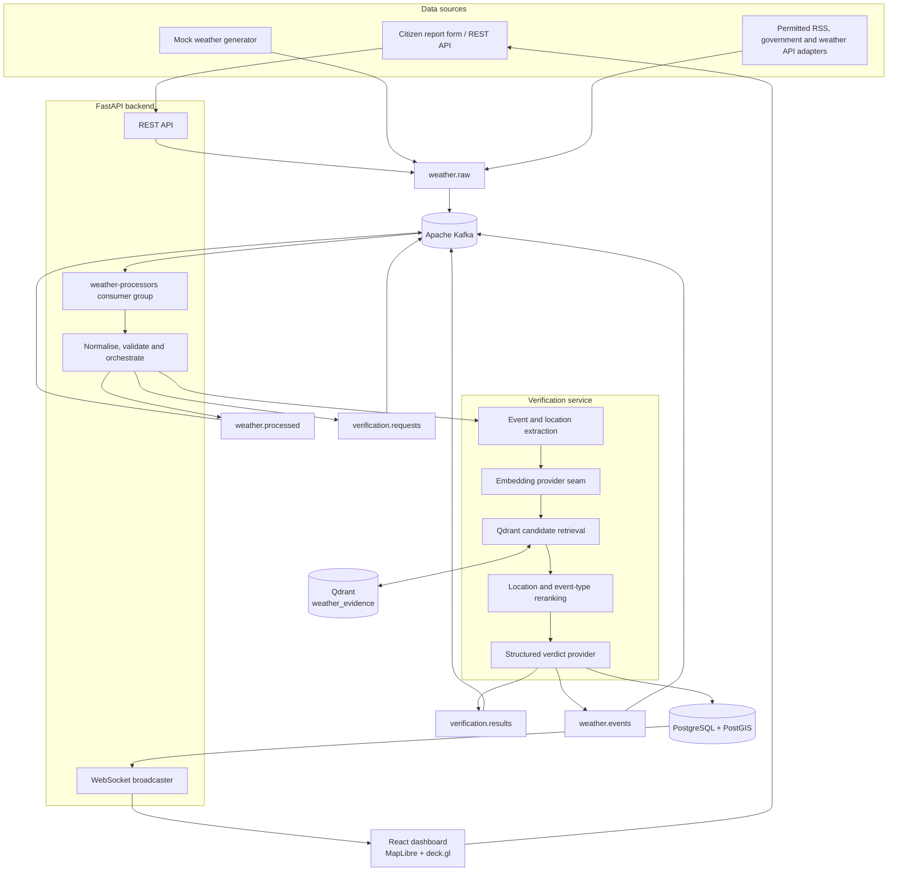
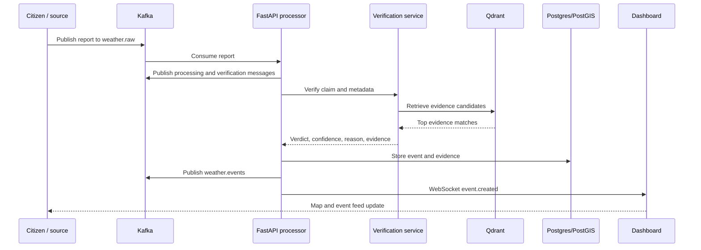

# National Weather Intelligence Platform

An open-source, Dockerized MVP for turning noisy weather reports into explainable, geospatial weather events for India.

It accepts citizen and mock reports, streams them through Kafka, retrieves relevant trusted evidence from Qdrant, assigns an evidence-grounded verdict, stores the result in PostgreSQL/PostGIS, and immediately displays it on a live map dashboard.

> This is a working vertical-slice prototype: its purpose is to demonstrate the complete flow, not production-scale model serving or nationwide data coverage.

## What it does

- Accepts weather reports with text, coordinates, event type, timestamp, location name, and an optional image URL.
- Streams reports through Kafka to decouple collection from processing.
- Identifies an event type and location from report content.
- Retrieves and reranks candidate evidence from Qdrant.
- Returns an explainable `SUPPORTED`, `REFUTED`, `MISLEADING`, or `UNCERTAIN` verdict.
- Stores events, evidence, reports, AI outcomes, and human-review decisions in PostgreSQL/PostGIS.
- Broadcasts verified events through WebSockets so the React dashboard updates without polling.
- Includes a mock collector, so the entire demo runs without external data APIs.

## Architecture



### Event lifecycle



## Quick start

### Prerequisites

- Docker Engine with Docker Compose v2
- At least 4 GB of memory available to Docker is recommended.

### Start the platform

```bash
cp .env.example .env
docker compose up --build
```

When containers are healthy, open:

| Service | URL |
| --- | --- |
| Live dashboard | `http://localhost:5173` |
| FastAPI Swagger documentation | `http://localhost:8000/docs` |
| API health endpoint | `http://localhost:8000/health` |
| Qdrant dashboard | `http://localhost:6333/dashboard` |

The collector emits a demonstration event every 20 seconds. You can also submit one through the dashboard.

### Stop the platform

```bash
docker compose down
```

To also remove the local database and vector data:

```bash
docker compose down --volumes
```

## Submit a report

Use Swagger, the dashboard form, or the API directly:

```bash
curl -X POST http://localhost:8000/api/reports \
  -H 'Content-Type: application/json' \
  -d '{
    "text": "Heavy rainfall and flooding near Madurai railway station.",
    "latitude": 9.9195,
    "longitude": 78.1193,
    "event_type": "FLOOD",
    "location_name": "Madurai"
  }'
```

The API returns `202 Accepted` with an `event_id`. The report is then streamed, verified, persisted, and pushed to connected dashboards.

## Verification model

The verifier does not give a binary “real/fake” classification. It returns one of four evidence-grounded outcomes:

| Verdict | Meaning |
| --- | --- |
| `SUPPORTED` | Retrieved trusted evidence is geographically and event-type consistent with the claim. |
| `REFUTED` | The report contradicts the stated weather-event claim. |
| `MISLEADING` | The event might be real, but contextual evidence such as an archived/reused image indicator does not support its stated time or place. |
| `UNCERTAIN` | Evidence is too weak or nonspecific; human review is recommended. |

Every result includes a confidence score, concise reason, extracted event/location context, model name, and the evidence used.

### AI implementation boundary

The default `local-heuristic` provider makes the demo deterministic and runnable without downloading multi-gigabyte models. It seeds Qdrant with trusted demonstration advisories, retrieves candidates using development embeddings, and applies transparent location/event-type reranking.

The AI service is designed so its embedding, reranking, and verdict-provider seams can be replaced by Qwen3-Embedding, Qwen3-Reranker, and Qwen3-VL served through Ollama or vLLM—without changing the API or frontend contracts. OCR and image pHash are reserved for that production-model adapter layer.

## Dashboard

The single-page dashboard provides:

- A MapLibre base map with deck.gl scatter and heatmap layers.
- Colour-coded verdict markers.
- Live stream connection state.
- Verdict filters and real-time counts.
- Event feed with confidence scores.
- Evidence drawer showing AI reasoning and retrieved sources.
- A citizen-report submission form for the demo incident flow.

## API

| Method | Endpoint | Purpose |
| --- | --- | --- |
| `GET` | `/health` | Service health check. |
| `POST` | `/api/reports` | Submit a citizen weather report. |
| `GET` | `/api/events` | List events; filter by event/status/state/district/source/confidence. |
| `GET` | `/api/events/{event_id}` | Retrieve one event and its evidence. |
| `GET` | `/api/events/nearby` | Find in-memory events within a coordinate radius for the MVP. |
| `GET` | `/api/events/heatmap` | Get point/weight data for map density rendering. |
| `GET` | `/api/evidence/{event_id}` | Retrieve evidence for an event. |
| `GET` | `/api/statistics` | Get dashboard totals and event breakdowns. |
| `POST` | `/api/admin/events/{event_id}/verify` | Record an admin human verdict. |
| `WS` | `/ws/events` | Receive `event.created` updates in real time. |

Full request/response schemas are available at `/docs` while the backend is running.

## Data model

PostgreSQL/PostGIS initialises these core tables:

| Table | Purpose |
| --- | --- |
| `weather_events` | Verified event, location, source, verdict, confidence, AI/human review fields, and PostGIS geography point. |
| `reports` | Raw input reports and metadata. |
| `evidence` | Retrieved evidence, provenance, similarity, and rerank scores. |
| `verification_results` | Structured verifier outputs and model metadata. |

Spatial, event-type, verification-status, and timestamp indexes are created in [database/init.sql](database/init.sql).

## Kafka topics

| Topic | Role |
| --- | --- |
| `weather.raw` | New reports emitted by the API, mock collector, or source adapters. |
| `weather.processed` | Normalised report entering verification. |
| `verification.requests` | Verification work requests. |
| `verification.results` | Structured AI outcomes. |
| `weather.events` | Completed weather events. |
| `weather.dlq` | Reserved dead-letter topic for repeatedly failing messages. |

## Project layout

```text
.
├── frontend/          React + Vite + TypeScript dashboard
├── backend/           FastAPI REST/WebSocket service and Kafka consumer
├── ai-service/        Evidence retrieval and structured verification service
├── collector/         Source adapter contracts and mock generator
├── database/          PostGIS schema initialisation
├── data/              Demo evidence and report asset location
├── qdrant/            Qdrant seed asset location
├── docker-compose.yml Local service topology
└── .env.example       Safe environment-variable template
```

## Environment variables

Copy `.env.example` before starting. The main settings are:

| Variable | Default | Purpose |
| --- | --- | --- |
| `POSTGRES_HOST` | `postgres` | PostgreSQL service host. |
| `KAFKA_BOOTSTRAP_SERVERS` | `kafka:9092` | Kafka broker address. |
| `QDRANT_HOST` | `qdrant` | Qdrant service host. |
| `AI_SERVICE_URL` | `http://ai-service:8001` | Backend-to-verifier address. |
| `MOCK_INTERVAL_SECONDS` | `20` | Interval for demo source messages. |
| `AI_MODEL` | `local-heuristic` | Current verifier provider identifier. |

Never commit real API credentials. `IMD_API_KEY` and `WEATHER_API_KEY` are placeholders for permitted source adapters.

## Development checks

```bash
python -m compileall -q backend/app ai-service/app collector
npm --prefix frontend run build
docker compose config --quiet
```

## Roadmap

- Add authorised IMD, government, RSS, and weather API adapters.
- Implement image upload, MIME/size validation, OCR, pHash, and duplicate clustering.
- Replace development embeddings/verdict provider with Qwen3 model adapters.
- Persist and query all event reads directly from PostgreSQL rather than the resilient development cache.
- Add spatial bounding-box queries, authentication, role-based admin review, monitoring, retries, and DLQ publishing.
- Extend the processing interface to Spark Structured Streaming and a Bronze/Silver/Gold lakehouse pipeline when scale requires it.

## License

Released under the [MIT License](LICENSE).
